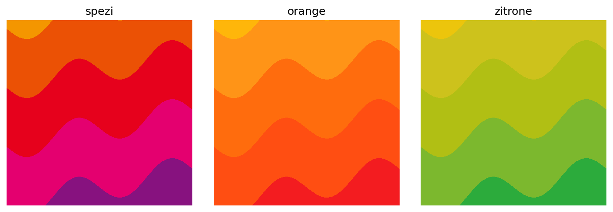
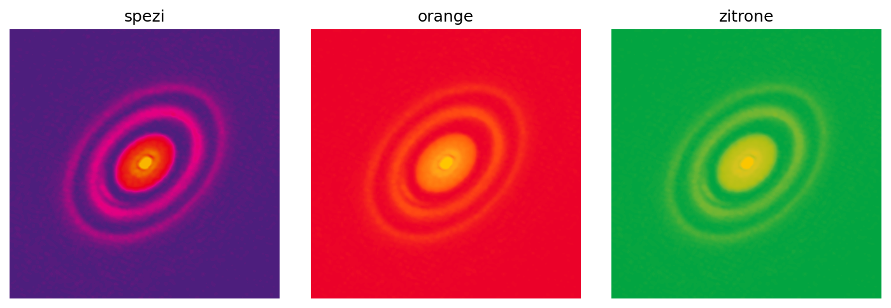

# Paulaner Colormaps

Paulaner-inspired colormaps for [Matplotlib](https://matplotlib.org/).



## Installation

```bash
pip install paulaner_colormaps
```

## Usage

```python
import paulaner_colormaps

paulaner_colormaps.orange
paulaner_colormaps.spezi
paulaner_colormaps.zitrone
```

## Example

See the [example notebook](examples/example.ipynb) for more detailed examples, e.g. the protoplanetary disk HD 163296 from [Andrews et al. (2018)](https://iopscience.iop.org/article/10.3847/2041-8213/aaf741):

